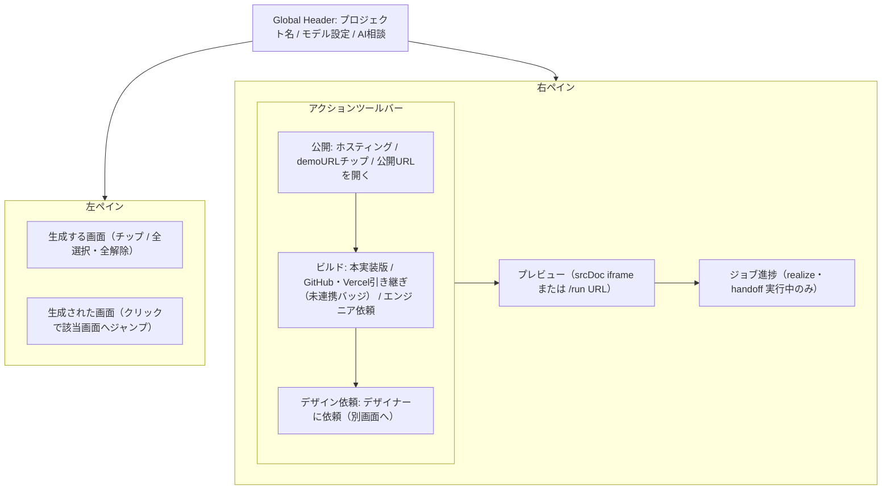
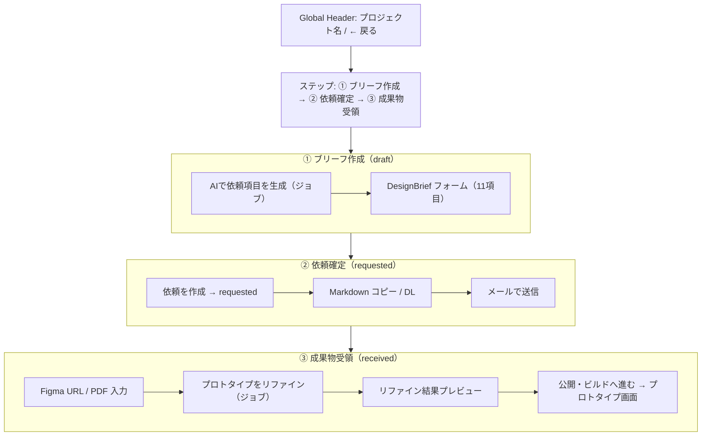
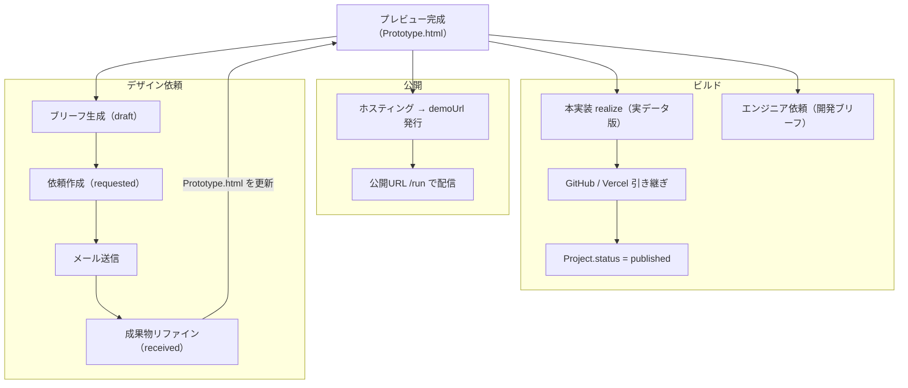

# OOUI分析: プレビュー完成後のアクション（公開 / ビルド / デザイン依頼）

> 対象: MVP Builder の `/studio/[id]/prototype`（プレビュー完成後のツールバーアクション）および `/studio/[id]/design-request`
> 前段ユースケース: 画面選択 → プレビュー生成（`prototype-screen-selection.md`）

---

## Step 1: アクター整理

| アクター | 役割・文脈 |
|---|---|
| ビルダー利用者 | ログイン済みのプロジェクト所有者。プレビューを完成させた後に公開・ビルド・デザイン依頼を行う主役 |
| 社外デザイナー | デザイン依頼ブリーフを受け取り、FigmaまたはPDFで成果物を返す外部の協力者 |
| エンジニア（依頼先） | エンジニア依頼ブリーフを受け取り、コードを引き継ぐ外部の開発者（現状はブリーフ作成まで） |
| エンドユーザー | 公開されたMVP（`/run/[projectId]`）を利用する最終受益者 |
| 外部サービス（GitHub / Vercel） | handoffフローで自動リポジトリ生成・デプロイを行う外部システム |

---

## Step 2: 主要ユースケース

### アクター: ビルダー利用者

#### 公開系
- UC-1a. プレビューをホスティングして共有URLを発行する（S3/CloudFront）
- UC-1b. 公開URLを開く（`/run/[projectId]`）
- UC-1c. 共有URLをコピー・配布する

#### ビルド系
- UC-2a. 本実装版（realizeモード）に書き換えて実データが動くプレビューを得る
- UC-2b. GitHubリポジトリ生成 + Vercelデプロイで外部引き継ぎする
- UC-2c. エンジニアに開発依頼ブリーフを作成する（`/studio/[id]/engineer-request`）

#### デザイン依頼系
- UC-3a. AIでデザインブリーフを下書きする
- UC-3b. ブリーフを手動で編集・完成させる
- UC-3c. 依頼を作成し、ブリーフMarkdownをコピー/ダウンロードする
- UC-3d. デザイナーにメールで依頼を送信する
- UC-3e. デザイナーの成果物（Figma URL / PDF）を登録する
- UC-3f. 成果物を参照デザインとしてプロトタイプをリファイン（再生成）する

### アクター: 社外デザイナー
- UC-D1. 受け取ったブリーフを確認する
- UC-D2. FigmaまたはPDFで成果物を納品する

### アクター: エンドユーザー
- UC-E1. 公開MVPを利用する（データ作成・閲覧・削除）

---

## Step 3: オブジェクト抽出（名詞・動詞モデリング）

### 名詞から抽出したオブジェクト候補

ユースケース文中の主要名詞:
プロトタイプ、プレビュー、共有URL、ホスティング、公開URL、ビルド（本実装/引き継ぎ）、GitHubリポジトリ、Vercelデプロイ、エンジニア依頼、デザイン依頼、ブリーフ、成果物（FigmaURL/PDF）、ジョブ、プロジェクト、デザイナー

### フィルタリング・統合後のオブジェクト定義

#### オブジェクト 1: Prototype（プロトタイプ）

| 項目 | 内容 |
|---|---|
| 説明 | プレビューHTMLを保持する成果物。1プロジェクトに対して実質1個（再生成で上書き） |
| プロパティ | html, demoUrl（ホスティングURL）, githubRepoUrl, deploymentUrl, status（generating/complete/truncated）, engine（aws/v0）, mode（create/realize）|
| アクション | 生成する(), 再生成する(), ホスティングする(), 公開URLを開く(), 本実装版に書き換える（realize）(), GitHub/Vercelに引き継ぐ（handoff）() |
| ビュー | シングルビュー（プレビューiframe + アクションツールバー）|

#### オブジェクト 2: DesignRequest（デザイン依頼）

| 項目 | 内容 |
|---|---|
| 説明 | デザイナーへのリファイン依頼。1プロジェクトに1件（upsert管理） |
| プロパティ | brief（DesignBrief構造体）, status（draft/requested/received）, figmaUrl, pdfName, pdfData, refinedNote, refinedHtml, refinedDemoUrl |
| アクション | ブリーフを生成する_AI(), ブリーフを編集する(), 依頼を作成する（requested）(), Markdownをコピーする(), Markdownをダウンロードする(), メールで送信する(), 成果物を登録する(), リファインする_AI() |
| ビュー | シングルビュー（3段フロー: ブリーフ作成 → 依頼確定 → 成果物受領）|

#### オブジェクト 3: DesignBrief（デザインブリーフ）

| 項目 | 内容 |
|---|---|
| 説明 | DesignRequestに内包されるデザイン仕様の構造体。独立した画面を持たず DesignRequest のプロパティとして扱う |
| プロパティ | productName, overview, objective, targetUsers, scopeScreens, brand, references, constraints, emphasis, deliverable（figma/pdf）, deadline |
| 設計注 | DesignRequest のサブオブジェクト（独立オブジェクトではない）。フォームの各フィールドとして表示される |

#### オブジェクト 4: EngineerRequest（エンジニア依頼）

| 項目 | 内容 |
|---|---|
| 説明 | エンジニアへの開発引き継ぎブリーフ。`/studio/[id]/engineer-request` で管理 |
| プロパティ | brief（テキスト）, deliverable, status（draft/requested）|
| アクション | ブリーフを生成する_AI(), ブリーフを編集する(), 依頼を作成する() |
| ビュー | シングルビュー（別画面） |

#### オブジェクト 5: Job（ジョブ）

| 項目 | 内容 |
|---|---|
| 説明 | 非同期AI生成処理の状態管理オブジェクト。ユーザーに「処理中」を可視化するためのもの |
| プロパティ | kind（prototype/design-brief/design-refine）, status（pending/running/completed/failed）, progress（文字数）, result（HTML or エラー）|
| アクション | 進捗を確認する(), キャンセルする() |
| 設計注 | Jobはユーザーがナビゲートするオブジェクトではなく、Prototype・DesignRequestの「処理状態」として表現すべき（インラインステータス表示）|

#### オブジェクト 6: Project（プロジェクト）

| 項目 | 内容 |
|---|---|
| 説明 | すべての成果物を束ねるルートオブジェクト |
| プロパティ | name, status（draft/analyzing/designing/generating/published）, その他分析結果 |
| アクション | 公開する（published）() ← handoff成功時に自動遷移 |
| 備考 | 本分析スコープのオブジェクト群はすべてProjectの子として管理される |

### 動詞から抽出したアクション分類

| アクション | 対象オブジェクト | 種別 |
|---|---|---|
| ホスティングする | Prototype | 非同期処理（API呼び出し）|
| 公開URLを開く | Prototype | ナビゲーション |
| 本実装版に書き換える（realize）| Prototype | 非同期AIジョブ |
| GitHub/Vercelに引き継ぐ（handoff）| Prototype | 非同期API呼び出し |
| ブリーフを生成する_AI | DesignRequest | 非同期AIジョブ |
| 依頼を作成する | DesignRequest | 状態遷移（draft → requested）|
| Markdownをコピー/DLする | DesignRequest | クリップボード/DL操作 |
| メールで送信する | DesignRequest | 外部API呼び出し |
| 成果物を登録する | DesignRequest | フォーム保存 |
| リファインする_AI | DesignRequest | 非同期AIジョブ → Prototype更新 |

---

## Step 4: オブジェクト間の関連図

```
Project（ルート）
│  status: draft → analyzing → designing → generating → published
│
├── Prototype（1対1）
│   │  html, demoUrl, githubRepoUrl, deploymentUrl
│   │  engine: aws | v0
│   │  mode: create | realize
│   │
│   ├── [アクション: ホスティング] → demoUrl 発行
│   ├── [アクション: realize] → html 書き換え（LQ SDK注入）
│   └── [アクション: handoff] → githubRepoUrl / deploymentUrl 生成
│                               → Project.status = published
│
├── DesignRequest（1対1）
│   │  status: draft → requested → received
│   │
│   ├── DesignBrief（サブ構造体・フォームとして表示）
│   │   productName, overview, objective, targetUsers,
│   │   scopeScreens, brand, references, constraints,
│   │   emphasis, deliverable, deadline
│   │
│   ├── 成果物: figmaUrl | (pdfName + pdfData)
│   └── [アクション: refine] → Prototype の html/demoUrl を更新
│
├── EngineerRequest（1対1）
│   brief, deliverable, status: draft → requested
│
└── Job（1対多・処理ごとに生成）
    kind: prototype | design-brief | design-refine
    status: pending → running → completed | failed
    ※ UIではPrototype/DesignRequestのインラインステータスとして表示
```

### オブジェクト間の主要な依存関係

```
DesignRequest --[refine]--> Prototype
  （リファイン結果はPrototypeとして保存され、以降の公開/ビルドに続く）

Prototype --[handoff成功]--> Project.status=published

Job --[完了]--> Prototype.html 更新 or DesignRequest.refinedHtml 更新
```

---

## Step 5: まとめとワイヤーフレーム案

### 最終オブジェクトモデルの要点

1. **Prototype** がすべてのビルド/公開アクションの主体。ホスティング・realize・handoffはすべて「Prototypeに対するアクション」として整理される。
2. **DesignRequest** は依頼の3段ステータス（draft/requested/received）を持つ独立オブジェクト。ブリーフ（DesignBrief）はサブ構造体として内包。
3. **Job** はUIオブジェクトではなく「処理状態の可視化」として扱い、Prototype/DesignRequestのシングルビュー内にインラインで表示する。
4. **Project** がルートオブジェクト。handoff成功時のみ `published` に昇格する。

### ワイヤーフレーム案

---

#### 画面A: プロトタイプ画面 `/studio/[id]/prototype`
**オブジェクト: Prototype のシングルビュー**

```
┌─────────────────────────────────────────────────────────┐
│ [Global Header] プロジェクト名   [モデル設定] [AI相談]  │
├──────────────────┬──────────────────────────────────────┤
│                  │  [アクションツールバー]               │
│  左ペイン        │  ┌──────────────────────────────┐   │
│  - 生成する画面  │  │ 公開                          │   │
│    チップ群      │  │  [ホスティング]  demoUrl: ...  │   │
│  - 全選択/全解除 │  │  [公開URLを開く ↗]             │   │
│                  │  ├──────────────────────────────┤   │
│  生成された画面  │  │ ビルド                        │   │
│  - 画面名チップ  │  │  [本実装版に書き換え]          │   │
│    （クリックで  │  │  [GitHub/Vercelへ引き継ぎ]    │   │
│     プレビュー  │  │  [エンジニアに依頼 →]          │   │
│     スクロール）│  ├──────────────────────────────┤   │
│                  │  │ デザイン依頼                  │   │
│                  │  │  [デザイナーに依頼 →]          │   │
│                  │  └──────────────────────────────┘   │
│                  │                                      │
│                  │  [プレビューiframe / /run URL表示]   │
│                  │                                      │
│                  │  [ジョブ進捗インジケーター]           │
│                  │  （realize/handoff実行中のみ表示）    │
└──────────────────┴──────────────────────────────────────┘
```

**セクション構成**
| セクション | 内容 |
|---|---|
| アクションツールバー > 公開 | ホスティングボタン / 発行済みdemoURLチップ / 公開URLリンク |
| アクションツールバー > ビルド | 本実装版ボタン / handoffボタン（トークン未設定時はグレー + 「未連携」バッジ）/ エンジニア依頼リンク |
| アクションツールバー > デザイン依頼 | デザイナーに依頼ボタン（別画面遷移） |
| プレビューエリア | srcDoc iframe（create/realize切り替え）または /run URL のiframe |
| ジョブ進捗 | realize/handoff実行中に表示。文字数カウンタ、完了/エラー表示 |

---

#### 画面B: デザイン依頼画面 `/studio/[id]/design-request`
**オブジェクト: DesignRequest のシングルビュー（3段フロー）**

```
┌─────────────────────────────────────────────────────────┐
│ [Global Header] プロジェクト名   ← 戻る                 │
├─────────────────────────────────────────────────────────┤
│                                                         │
│  ステップインジケーター: [1 ブリーフ作成] [2 依頼確定] [3 成果物受領]
│                                                         │
│  ──── セクション1: ブリーフ作成（status=draft時アクティブ）────
│  [AIで依頼項目を生成] ボタン                            │
│  （ジョブ進捗バー: 生成中のみ表示）                     │
│                                                         │
│  フォーム（DesignBrief構造体）:                         │
│  ・プロダクト名                                         │
│  ・プロダクト概要                                       │
│  ・リファインの目的                                     │
│  ・ターゲット/ペルソナ                                  │
│  ・対象画面・スコープ                                   │
│  ・ブランド（配色・トーンマナー）                       │
│  ・参考デザイン                                         │
│  ・制約                                                 │
│  ・重視点・改善要望                                     │
│  ・成果物形式 [Figma / PDF] セレクト                    │
│  ・納期                                                 │
│                                                         │
│  ──── セクション2: 依頼確定（status=requested時アクティブ）────
│  [依頼を作成] ボタン（→ status=requested）              │
│  ─────────────────────────────────                     │
│  依頼作成済みバッジ（requested状態で表示）              │
│  Markdownプレビュー表示                                  │
│  [Markdownをコピー] [ダウンロード]                       │
│  デザイナーのメールアドレス入力                         │
│  [メールで送信]                                         │
│                                                         │
│  ──── セクション3: 成果物受領（requested以降アクティブ）────
│  Figma URL 入力フィールド                               │
│  PDF ファイルアップロード                               │
│  リファインメモ（オプション）                           │
│  [プロトタイプをリファイン] ボタン                      │
│  （ジョブ進捗バー: リファイン中のみ表示）               │
│  ─────────────────────────────────                     │
│  リファイン結果プレビュー（received状態で表示）         │
│  [公開・ビルドへ進む →] ← プロトタイプ画面に戻る       │
│                                                         │
└─────────────────────────────────────────────────────────┘
```

**セクション構成**
| セクション | 表示条件 | 主な要素 |
|---|---|---|
| ステップインジケーター | 常時 | draft/requested/receivedを視覚化 |
| ブリーフ作成 | 常時 | AIブリーフ生成ボタン + DesignBriefフォーム全フィールド |
| 依頼確定 | briefが入力されたら | 依頼作成ボタン → Markdownコピー/DL → メール送信 |
| 成果物受領 | status=requested以降 | Figma URL / PDF入力 + リファインボタン + 結果プレビュー |
| 公開・ビルドへ進む | status=received後 | プロトタイプ画面へのナビゲーション |

---

### ワイヤー案（Mermaid）

#### 画面A: プロトタイプ画面 `/studio/[id]/prototype`



#### 画面B: デザイン依頼画面 `/studio/[id]/design-request`



#### 全体フロー（オブジェクト中心：Prototype / DesignRequest 軸）



---

### 設計上の重要な洞察

1. **タスク指向の罠に注意**: 「公開する」「ビルドする」「依頼する」という3つのタスクを起点にUIを設計すると、3つのボタンが並んだタスク指向UIになる。代わりに「Prototype（プレビューの完成形）」と「DesignRequest（依頼の状態）」という2つのオブジェクトを軸に設計する。

2. **Prototypeのアクションは状態に依存**: realizeとhandoffは「現在のPrototypeを発展させる」アクションなので、Prototypeのシングルビュー内でのアクションとして提示する（別ページ遷移にしない）。

3. **DesignRequestの3段ステータスを視覚化**: draft/requested/receivedの状態を3ステップとしてUIに反映する。各ステップが何を意味するかユーザーが一目でわかるようにする。

4. **Jobのインライン表示**: ジョブオブジェクトをユーザーが直接操作するオブジェクトとして独立させず、処理中のPrototype/DesignRequestのステータス表示として表現する（「処理中バッジ」「進捗バー」など）。

5. **handoff未設定状態の透明性**: GITHUB_TOKEN/VERCEL_TOKENが未設定の場合、ボタンを非表示にするのではなく「未連携」状態で表示し、設定方法への誘導を提供する（オブジェクトの存在を隠さない）。

6. **リファイン後の継続性**: DesignRequestのリファイン結果はPrototypeとして保存される（`DesignRequest --[refine]--> Prototype`）ため、リファイン完了後は「公開・ビルドへ進む」というPrototypeシングルビューへの自然な導線を設ける。

---

## 参考

- ユースケース: `docs/usecase/post-preview-actions.md`
- 前段ユースケース: `docs/usecase/prototype-screen-selection.md`
- 実装: `src/app/studio/[id]/prototype/page.tsx`, `src/app/studio/[id]/design-request/page.tsx`
- OOUI参考資料: `/Users/coa/claudecode/docs/reference/ooui/`
